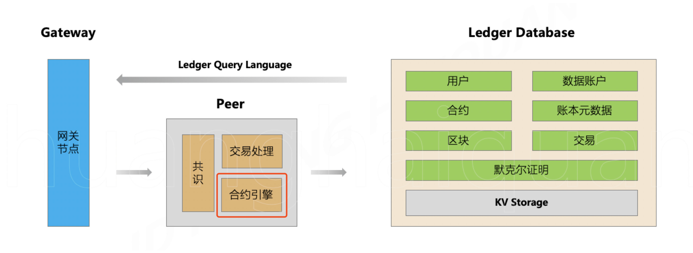

# JD Chain 智能合约系统 SPI 规范

### 版本：V1.0
### 修订：2019-12-30
## 


### 一、总体说明

JD Chain 中，智能合约系统由以下几个具体组件构成。

- 合约编程语言
- 合约集成开发工具
- 合约单元测试工具
- 合约代码编译器
- 合约引擎

其中，合约引擎是核心，是部署于共识节点中的一个独立组件。在合约引擎与其它组件之间定义了清晰的接口，可以实现组件之间的松耦合和可插拔。这些接口被称为 SPI（Service Provider Interface），描述了如何实现一个特定的合约引擎组件。通过提供不同的 SPI 实现，使得系统可以集成不同语言的合约系统。



JD Chain 中默认实现了基于 JVM 的合约引擎，支持 Java 语言的合约代码，以 Java 编译器编译合约，以 jar 包形式部署合约。在运行期，合约代码被装载到一个“安全沙盒”中，在受限和隔离环境下运行。

本文档描述了扩展实现一种新的智能合约系统需要遵循的一些基本要求。

### 二、基本要求

在 JD Chain 中提供一个新的智能合约系统，需要实现以下几个方面的功能组件：

- **合约编程语言(必须)**
- **合约引擎(必须)**
- 合约代码编译器(可选)
    
    注：对于解释型语言是可选的，**但是对于编译型语言是必须的，要求具有编译和反编译的功能**。

- 合约集成开发工具(可选)
- 合约单元测试工具(可选)

其中，合约引擎是关键部分，它是合约代码的执行器。

合约引擎需要实现几个基本功能：

- 装载和校验合约代码；
- 执行合约代码；
- 卸载合约代码；
- 合约代码安全沙盒机制，隔离物理系统调用；
- 合约代码安全沙盒机制，隔离单合约执行环境；
- 回调账本操作代理读写账本数据；

### 三、合约引擎接口规范

合约引擎的 SPI 的代码定义位于 contract-framework 工程中，位于[**jdchain-framework**](https://github.com/blockchain-jd-com/jdchain-framework) 项目库。

核心接口有 4 个：

1. [合约服务提供者: ContractServiceProvider](https://github.com/blockchain-jd-com/jdchain-framework/blob/master/contract-framework/src/main/java/com/jd/blockchain/contract/engine/ContractServiceProvider.java)

    合约服务提供者 ContractServiceProvider 用于定义了一种特定的合约引擎(ContractEngine)的实现。

    ContractServiceProvider 作为合约引擎(ContractEngine)实例的工厂，同时管理合约引擎的生命周期。

```
/**
 * 合约服务提供者 {@link ContractServiceProvider}
 * 
 * 用于定义了一种特定的合约引擎({@link ContractEngine})的实现。
 */
public interface ContractServiceProvider {

	/**
	 * 合约服务提供者的名称；
	 * 
	 * @return
	 */
	String getName();

	/**
	 * 返回合约代码执行引擎实例；
	 * 
	 * @return
	 */
	ContractEngine getEngine();

}

```

2. [合约引擎: ContractEngine](https://github.com/blockchain-jd-com/jdchain-framework/blob/master/contract-framework/src/main/java/com/jd/blockchain/contract/engine/ContractEngine.java)


```
/**
 * 合约引擎；
 */
public interface ContractEngine {

	/**
	 * 返回指定地址的合约代码；<br>
	 * 
	 * 如果不存在，则返回 null；
	 * 
	 * @param address
	 * @return
	 */
	ContractCode getContract(Bytes address, long version);

	/**
	 * 装入合约代码；<br>
	 * 
	 * 如果已经存在，则直接返回已有实例；
	 * 
	 * @param address
	 * @param codeBytes
	 * @return
	 */
	ContractCode setupContract(Bytes address, long version, byte[] codeBytes);

}

```

3. [合约代码: ContractCode](https://github.com/blockchain-jd-com/jdchain-framework/blob/master/contract-framework/src/main/java/com/jd/blockchain/contract/engine/ContractCode.java)


```
/**
 * 合约代码
 */
public interface ContractCode {

	/**
	 * 合约地址；
	 * <p>
	 * 
	 * 返回合约引擎({@link ContractEngine})装载合约代码时由系统指定的合约地址；
	 * <p>
	 * 
	 * @return
	 */
	Bytes getAddress();

	/**
	 * 合约版本；
	 * <p>
	 * 
	 * 返回合约引擎({@link ContractEngine})装载合约代码时由系统指定的合约版本；
	 * <p>
	 * 
	 * @return
	 */
	long getVersion();

	/**
	 * 处理合约事件；
	 * 
	 * @param eventContext 合约事件上下文，包含了要处理的合约事件、交易请求，以及提供了在合约代码中用于读写账本的对象；
	 * @return 合约事件的返回值；如果是调用了合约方法的，则返回合约方法的调用返回值；
	 */
	BytesValue processEvent(ContractEventContext eventContext);
}
```


4. [合约事件上下文: ContractEventContext](https://github.com/blockchain-jd-com/jdchain-framework/blob/master/ledger-model/src/main/java/com/jd/blockchain/contract/ContractEventContext.java)


```

/**
 * 合约事件上下文；
 */
public interface ContractEventContext {

	/**
	 * 当前账本哈希；
	 *
	 * @return
	 */
	HashDigest getCurrentLedgerHash();

	/**
	 * 执行合约事件的交易请求；
	 *
	 * @return
	 */
	TransactionRequest getTransactionRequest();

	/**
	 * 交易的签署人集合；
	 *
	 * @return
	 */
	Set<BlockchainIdentity> getTxSigners();

	/**
	 * 事件名称；
	 *
	 * @return
	 */
	String getEvent();

	/**
	 * 参数列表；
	 *
	 * @return
	 */
	BytesValueList getArgs();

	/**
	 * 账本操作上下文；
     *
	 * 通过在合约执行过程中回调此对象，对账本进行读写操作。
     *
	 * @return
	 */
	LedgerContext getLedger();

	/**
	 * 合约的拥有者集合；
	 *
	 * <br>
	 * 合约的拥有者是部署合约时的签名者；
	 *
	 * @return
	 */
	Set<BlockchainIdentity> getContracOwners();

}

```


### 三、合约引擎安全规范

由于合约引擎装载执行的合约代码是来在区块链系统外定义的，因此需要合约引擎的实现要具备很强的安全沙盒机制，严格防范恶意的代码对区块链系统、以及运行区块链系统的相关服务器环境进行攻击。具体的安全控制能力需要包括但不限于以下的方面：

- 合约代码不允许调用系统的IO操作，包括磁盘、网络等；
- 合约代码不允许调用系统命令；
- 合约代码无法获得系统的特权，只能在区块链系统进程空间中执行；
- 合约代码必须严格按照区块链交易提供的合约事件指令指定的参数和上下文信息执行；
- 合约代码必须严格按照开发者开发的合约代码所声明的逻辑执行操作账本；
- 合约代码的执行环境需要与系统环境严格隔离；
- 不同的合约代码之间的执行环境需要相互隔离；
- 合约代码必须严格唯一地只通过区块链系统提供的账本操作代理对象读写账本；
